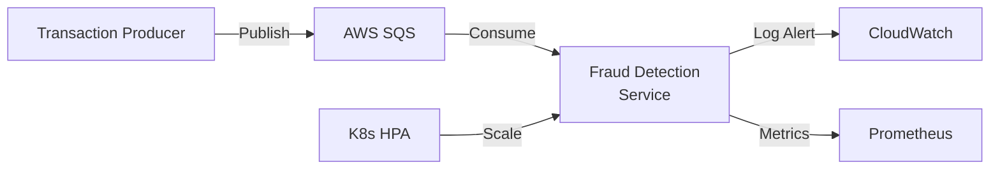

# Real-Time Fraud Detection System

A production-ready, cloud-native real-time fraud detection system built with Java 21, Spring Boot 3, and deployed on Kubernetes with AWS support.

## 🎯 Overview

This system demonstrates enterprise-grade software engineering practices including:

- **Strategy Pattern** for extensible fraud detection rules
- **AWS Integration** with SQS for message queuing
- **Kubernetes-native** with HPA, health checks, and graceful shutdown
- **Infrastructure as Code** using Terraform
- **Full CI/CD pipeline** with GitHub Actions
- **Comprehensive testing** with JUnit 5 and Testcontainers
- **Observability** with structured logging and Prometheus metrics

## 🏗️ Architecture



### Components

1. **Transaction Producer**: Generates financial transactions and publishes to AWS SQS
2. **Fraud Detection Service**: Consumes transactions, applies fraud rules, generates alerts
3. **Message Queue**: AWS SQS with DLQ support
4. **Kubernetes**: Orchestration with auto-scaling and self-healing

## 🚀 Quick Start

### Prerequisites

- Java 21
- Docker
- Kubernetes cluster (kind/minikube for local, EKS for cloud)
- kubectl
- Helm 3.x
- Terraform (for AWS infrastructure)

### Local Development with Docker Compose

```bash
# Start LocalStack and services
docker-compose up -d

# View logs
docker-compose logs -f fraud-detection-service

# Generate transactions
curl -X POST http://localhost:8081/api/transactions/generate/batch?count=10

# Cleanup
docker-compose down
```

### Local Kubernetes Deployment

```bash
# Create local cluster and deploy
./scripts/k8s/deploy-local.sh

# Access services
kubectl port-forward svc/transaction-producer 8081:8081 -n fraud-detection

# Generate test transactions
curl -X POST http://localhost:8081/api/transactions/generate
```

## 📦 Project Structure

```
.
├── fraud-detection-service/    # Core fraud detection microservice
│   ├── src/main/java/
│   │   └── com/hsbc/fraud/detection/
│   │       ├── rule/            # Strategy Pattern fraud rules
│   │       ├── service/         # Business logic
│   │       └── messaging/       # Multi-cloud abstraction
│   └── src/test/java/          # Unit & integration tests
├── transaction-producer/        # Transaction simulator
├── helm/                        # Helm charts for K8s deployment
│   ├── fraud-detection/
│   └── transaction-producer/
├── terraform/                   # Infrastructure as Code
│   └── aws/                     # AWS resources (SQS, IAM, EKS)
├── .github/workflows/           # CI/CD pipelines
├── scripts/                     # Utility scripts
│   ├── resilience/              # Chaos engineering tests
│   └── k8s/                     # Deployment helpers
└── docs/                        # Additional documentation
```

## 🐳 Building Docker Images

This project uses **Gradle with Jib plugin** for building and publishing Docker images. No Docker daemon required!

### Quick Commands

```bash
# Build Docker images locally (no Docker required)
./gradlew buildAllImages

# Build and publish to registry
./gradlew publishAllImages \
  -PdockerRegistry=ghcr.io/yourorg \
  -PdockerUsername=your-username \
  -PdockerPassword=your-token

# Or use environment variables
$env:DOCKER_REGISTRY = "ghcr.io/yourorg"
$env:DOCKER_USERNAME = "your-username"
$env:DOCKER_PASSWORD = "your-token"
./gradlew publishAllImages
```

**For comprehensive Docker build documentation, see [DOCKER.md](DOCKER.md)**

## 🧪 Testing

The project uses a two-tier testing strategy:

### Unit Tests (Fast, No Docker Required)

Unit tests run quickly and don't require external dependencies:

```bash
./gradlew test
```

These include:
- Fraud rule tests with mocked data
- Service layer tests with mocked dependencies
- Basic integration tests without external services

### Integration Tests (Requires Docker)

Integration tests use Testcontainers to spin up LocalStack for AWS SQS testing:

```bash
./gradlew integrationTest
```

**Note:** These tests require Docker to be running. They are marked with `@Tag("integration")` and are automatically excluded from the standard `test` task.

### Run All Tests

```bash
./gradlew test integrationTest
```

### Coverage Report

```bash
./gradlew jacocoTestReport
open fraud-detection-service/build/reports/jacoco/test/html/index.html
```

### Resilience Testing

```bash
# Deploy to cluster first
./scripts/resilience/chaos-test.sh

# Load testing
./scripts/resilience/load-test.sh
```

## ☁️ Cloud Deployment

### AWS (EKS + SQS)

```bash
# 1. Provision infrastructure
cd terraform/aws
terraform init
terraform apply

# 2. Configure kubectl
aws eks update-kubeconfig --name fraud-detection-cluster

# 3. Deploy with Helm
helm upgrade --install fraud-detection ./helm/fraud-detection \
  --namespace fraud-detection \
  --create-namespace \
  --values ./helm/values-aws-prod.yaml
```

## 📊 Monitoring & Observability

### Metrics

Access Prometheus metrics at `/actuator/prometheus`:

```bash
kubectl port-forward svc/fraud-detection 8080:8080 -n fraud-detection
curl http://localhost:8080/actuator/prometheus
```

### Logs

Structured JSON logs for CloudWatch:

```bash
kubectl logs -f -l app.kubernetes.io/name=fraud-detection -n fraud-detection
```

### Health Checks

```bash
# Liveness
curl http://localhost:8080/actuator/health/liveness

# Readiness
curl http://localhost:8080/actuator/health/readiness
```

## 🔧 Fraud Detection Rules

The system uses the **Strategy Pattern** for extensible fraud detection:

### Built-in Rules

1. **LargeAmountRule**: Flags transactions exceeding $10,000
2. **SuspiciousAccountRule**: Checks accounts against blacklist
3. **RapidFireRule**: Detects >5 transactions/minute from same account

### Adding New Rules

```java
@Component
public class MyCustomRule implements FraudRule {
    @Override
    public boolean isFraudulent(Transaction transaction) {
        // Your logic here
        return false;
    }
    
    @Override
    public String getRuleName() {
        return "MY_CUSTOM_RULE";
    }
    
    @Override
    public String getReason(Transaction transaction) {
        return "Custom violation detected";
    }
}
```

## 🔄 CI/CD Pipeline

### Automated Workflows

All workflows now use **Gradle/Jib** for building and publishing Docker images:

- **PR Validation**: Build, test, and code quality checks
- **Deploy to Test**: Automatic deployment on merge to `main`
  - Builds Docker images using `./gradlew publishAllImages`
  - Deploys to AWS test environment
- **Deploy to Prod**: Manual approval with rollback capability
  - Uses pre-built images from test environment
  - Requires 2 approvals from platform-team or security-team

### Triggering Deployments

```bash
# Deploy to production
gh workflow run deploy-prod.yml -f version=<commit-sha> -f environment=prod-aws

# Rollback
gh workflow run rollback.yml -f environment=prod-aws -f revision=0
```

**For detailed workflow documentation, see [.github/workflows/README.md](.github/workflows/README.md)**

## 🏗️ Design Decisions

### Why Strategy Pattern?

- **Open/Closed Principle**: Add new rules without modifying existing code
- **Testability**: Each rule can be tested independently
- **Flexibility**: Rules can be enabled/disabled via configuration

### Why AWS?

- **Maturity**: Robust, battle-tested services
- **Integration**: Native integration with Kubernetes (EKS)
- **Tooling**: Excellent monitoring and logging with CloudWatch

### Why Kubernetes?

- **Auto-scaling**: HPA adjusts capacity based on load
- **Self-healing**: Automatic pod restart on failures
- **Rolling Updates**: Zero-downtime deployments
- **Portability**: Runs anywhere (local, AWS, on-premises)

## 📈 Performance

- **Throughput**: >1000 transactions/second per pod
- **Latency**: P95 < 50ms for fraud detection
- **Recovery Time**: <30 seconds after pod failure
- **Availability**: 99.9% uptime with HPA min 3 replicas

## 🔒 Security

- **No Hardcoded Secrets**: Uses K8s Secrets and IAM roles
- **Least Privilege**: IAM policies grant minimum required permissions
- **Network Policies**: Pod-to-pod communication restricted
- **Container Scanning**: Trivy scans for vulnerabilities
- **Read-Only Root Filesystem**: Enhanced container security

## 🤝 Contributing

1. Fork the repository
2. Create a feature branch (`git checkout -b feature/amazing-feature`)
3. Commit your changes (`git commit -m 'Add amazing feature'`)
4. Push to the branch (`git push origin feature/amazing-feature`)
5. Open a Pull Request

## 📚 Additional Documentation

- [Docker Build & Publish Guide](DOCKER.md) - **NEW!** Comprehensive guide for building Docker images with Gradle
- [GitHub Actions Workflows](.github/workflows/README.md) - CI/CD pipeline documentation
- [Quick Start for Workflows](.github/workflows/QUICKSTART.md) - Quick reference for common operations
- [Architecture Deep Dive](docs/ARCHITECTURE.md)
- [Resilience Test Report](docs/RESILIENCE_REPORT.md)
- [AWS Infrastructure Guide](terraform/aws/README.md)

## 📝 License

This project is licensed under the Apache License 2.0 - see the [LICENSE](LICENSE) file for details.

## 🙏 Acknowledgments

- Spring Boot team for the excellent framework
- Kubernetes community for cloud-native patterns
- HashiCorp for Terraform
- Testcontainers for integration testing

## 📧 Contact

- Project Lead: [Your Name]
- Email: fraud-detection@example.com
- Issues: [GitHub Issues](https://github.com/hsbc/fraud-detection-system/issues)

---
